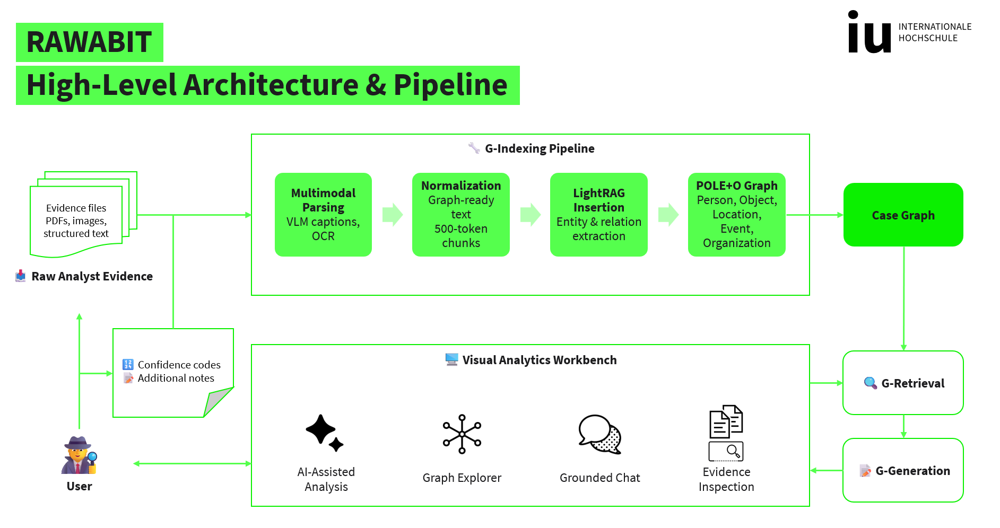
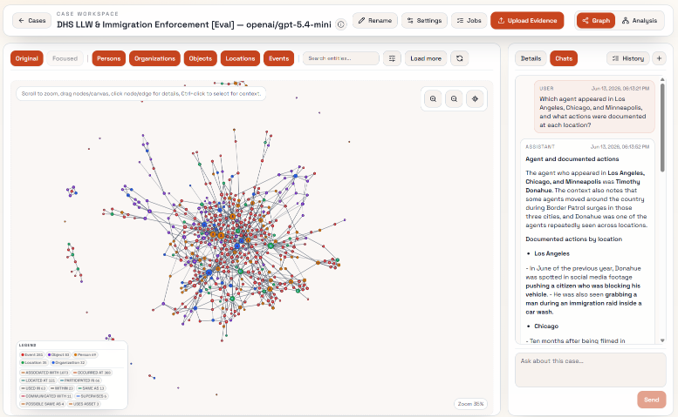

# Rawabit

**Rawabit** (روابط, *rawābiṭ* — Arabic for “connections” or “bonds”) is a GraphRAG-based investigative analysis prototype developed as part of my completed Master’s thesis in Artificial Intelligence at [IU International University of Applied Sciences](https://www.iu.de/).

The thesis was successfully defended and passed in July 2026. Rawabit integrates a FastAPI backend, a React/Vite frontend, LightRAG- and RAGAnything-based ingestion pipelines, interactive graph exploration, document search, evidence-grounded conversational analysis, and persistent analytical views.

This repository contains the research prototype, evaluation materials, and supporting artifacts for academic review, reproducibility, and continued development. It is not intended for production use.


## Project Overview

Rawabit transforms heterogeneous evidence into an explorable case graph, then supports graph-guided retrieval, evidence-grounded generation, and visual analytical workflows.

<p align="center">
  
</p>

## Interface

The main workspace combines an interactive graph explorer with entity filtering, evidence inspection, and grounded conversational analysis.

<p align="center">
  
</p>

## Demo

The short demo shows graph exploration and the grounded chat workflow.

<video src="docs/images/demo.mp4" controls width="100%">
  Your browser does not support embedded video.
</video>

## Core Capabilities

- Multimodal evidence ingestion and normalization
- Entity and relationship extraction into a case graph
- Interactive graph exploration and filtering
- Graph-guided and vector-based retrieval
- Evidence-grounded chat with source traceability
- Evidence inspection and saved analytical views

## Prerequisites

- Python with a conda environment named `rawabit`
- Node.js and npm
- A prepared storage bundle:
  - `data/rawabit.db`
  - `cases/`

If you are using the publication artifact for this project, copy its `data/` and `cases/` directories into the repository root before running.

## Install

From the repository root:

```powershell
conda activate rawabit
python -m pip install -r backend/requirements.txt
npm --prefix frontend install
```

## `.env` and API Keys

Copy the `.env.example` file in the repository root to `.env` before running the application:

```bash
cp .env.example .env
```

Pre-ingested cases can be browsed without re-ingesting them, but API keys are required for calls to external LLM, VLM, embedding, or reranking providers.

Open `.env` and fill in your keys:

```text
RAWABIT_LLM_PROVIDER_API_KEY=your_key_here
RAWABIT_EMBEDDING_PROVIDER_API_KEY=your_key_here
RAWABIT_RERANKING_PROVIDER_API_KEY=your_key_here
```

Rawabit uses OpenRouter.ai as its default universal model provider. You may substitute any provider that exposes an OpenAI-compatible API for the LLM and embedding endpoints. The reranking endpoint is currently supported only through OpenRouter.

| Endpoint | Compatible providers |
| --- | --- |
| LLM / VLM | OpenRouter, any OpenAI-compatible API, local models |
| Embedding | OpenRouter, any OpenAI-compatible API, local models |
| Reranking | OpenRouter only |

To point Rawabit at a local LLM or a self-hosted embedding server, override the base URL variables in `.env`:

```text
RAWABIT_LLM_PROVIDER_BASE_URL=http://localhost:11434/v1   # e.g. Ollama
RAWABIT_EMBEDDING_PROVIDER_BASE_URL=http://localhost:11434/v1
```

## Run

Start the backend:

```powershell
conda activate rawabit
python -m uvicorn backend.app.main:app --reload --host 127.0.0.1 --port 8000
```

In a second terminal, start the frontend:

```powershell
npm --prefix frontend run dev
```

Open the Vite URL shown in the terminal, usually:

```text
http://127.0.0.1:5173
```

## Storage Paths

By default, the backend reads:

```text
data/rawabit.db
cases/
```

To use a different storage location:

```powershell
$env:RAWABIT_DB_PATH="C:\path\to\rawabit.db"
$env:RAWABIT_CASES_ROOT="C:\path\to\cases"
python -m uvicorn backend.app.main:app --reload --host 127.0.0.1 --port 8000
```

## Optional Checks

Build the frontend:

```powershell
npm --prefix frontend run build
```

Run backend tests:

```powershell
conda activate rawabit
python -m pytest backend/tests
```

## Evaluation Reproduction

The DHS LLW evaluation workflow is documented separately:

```text
evaluation/DHS LLW & Immigration Enforcement/README.md
```

That README covers golden-query generation and validation, casepack setup, evaluation commands, and the published result folders.

## Notes

- The project focuses on a prototype developed for master's thesis evaluation.
- The included storage is expected to contain pre-ingested cases for reproducible review.


## Acknowledgements

Rawabit builds on [LightRAG](https://github.com/HKUDS/LightRAG) for graph-based indexing and retrieval. Credit and appreciation go to the LightRAG authors (HKUDS) and contributors for making their work openly available.
